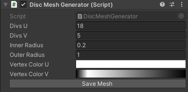

# Unity-VFXToolBox
<b>Unity-VFXToolBox</b> has a lot of tools for ParticleSystem. 
・Create Empty ParticleSystem 
・Shader Preset Tools (Custom Data & Custom Vertex Streams) 
・etc  

# Requirement
- Unity 2020.2.0 or higher
- Universal RP 10.2.2 or higher

 

## Git Path (Unity Package Manager)
> https://github.com/rngtm/Unity-VFXToolBox.git?path=Assets/VfxToolBox

 

## Usage (Shader Preset)
Shader Preset save ParticleSystem CustomData and VertexStreams in association with Shader. 
 

### STEP 1 : Create Preset
Window -> VFX ToolBox -> Material Preset Generator 
 

Use Meterial Preset Generator to create <i>ShaderPresetData</i>. 
 

Edit CustomData and Vertex Streams in ShaderPresetData. 
  

### STEP 2 : Register Preset
Register <i>ShaderPresetData</i> to <i>ShaderPresetDataBase</i>. 
  

### STEP 3 : Apply Preset

Window -> VFX ToolBox -> Material Preset Attacher 
 

Drag & Drop ParticleSystem to <i>Material Preset Attacher</i> window and click <i>apply</i> button. 
  

### Result
ParticleSystem's Custom Vertex Streams and Custom Data will be overwrited. 
 
 

# VFX Samples

## Installation (UPM)
You can install VFX samples via Unity Package Manager.

 
 

---

## Sample 001 (VFX Samples)
(TBW)

 

---

## Sample 002 (Aura VFX Samples)
(TBW)

 

---

## Sample 003 (Procedural Mesh Generator)
Sample 003 contains procedural mesh generator implemented in Unity C#. 
- Spiral Mesh Generator
- Disc Mesh Generator
- Cylinder Mesh Generator

## Disc Generator
You can generate disc mesh via *DiscMeshGenerator* component.

## Disc Generator Samples
There are few disc mesh samples in *Sample003_ProceduralMesh/Sample003_Disc.unity*.

 

---

## Spiral Mesh Generator
(TBW)

 

---

## Cylinder Mesh Generator
(TBW)
